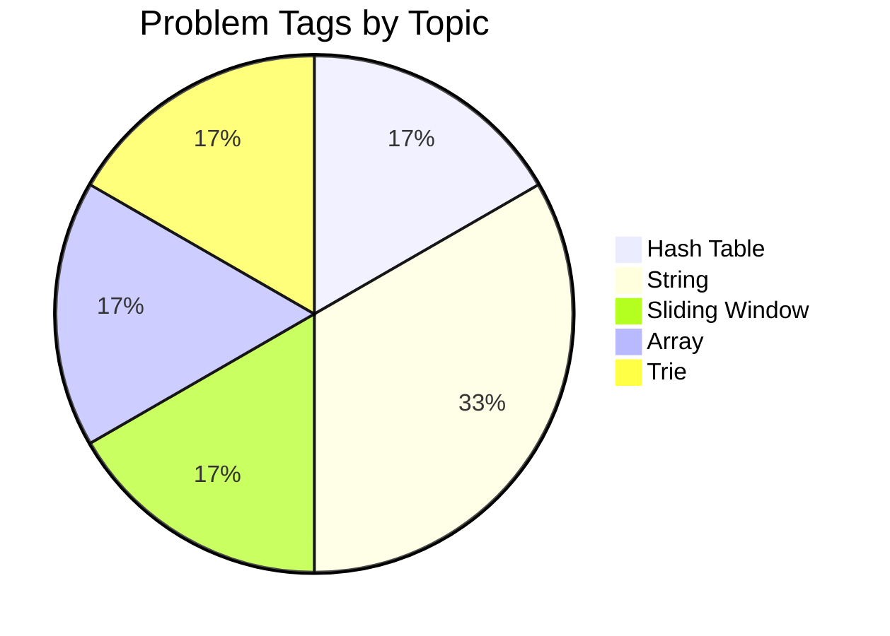

# LeetCode Solutions

A personal collection of LeetCode problems solved while preparing for coding interviews — automatically tracked and organized by topic using [LeetHub v2](https://github.com/arunbhardwaj/LeetHub-2.0).

  
  
  

---

## Progress

| Problems Solved | Topics Covered |
| :---: | :---: |
| 2 | 5 |

---

## Topic Distribution

---

## Solutions by Topic

<!---LeetCode Topics Start-->
# LeetCode Topics
## Hash Table
|  |
| ------- |
| [0003-longest-substring-without-repeating-characters](https://github.com/jithin-jz/https-github.com-jithin-jz-LeetCode/tree/master/0003-longest-substring-without-repeating-characters) |
## String
|  |
| ------- |
| [0003-longest-substring-without-repeating-characters](https://github.com/jithin-jz/https-github.com-jithin-jz-LeetCode/tree/master/0003-longest-substring-without-repeating-characters) |
| [0014-longest-common-prefix](https://github.com/jithin-jz/LeetCode/tree/master/0014-longest-common-prefix) |
## Sliding Window
|  |
| ------- |
| [0003-longest-substring-without-repeating-characters](https://github.com/jithin-jz/https-github.com-jithin-jz-LeetCode/tree/master/0003-longest-substring-without-repeating-characters) |
## Array
|  |
| ------- |
| [0014-longest-common-prefix](https://github.com/jithin-jz/LeetCode/tree/master/0014-longest-common-prefix) |
## Trie
|  |
| ------- |
| [0014-longest-common-prefix](https://github.com/jithin-jz/LeetCode/tree/master/0014-longest-common-prefix) |
<!---LeetCode Topics End-->

---

## How This Works

This repo is auto-updated by the LeetHub v2 browser extension — every time an accepted submission is made on LeetCode, the solution is pushed here and the topic table above is regenerated.

Everything outside the `LeetCode Topics Start/End` markers (this section, the badges, the progress table, the chart) is safe to edit by hand. Anything inside the markers gets rebuilt automatically on the next sync, so manual edits there won't persist.
