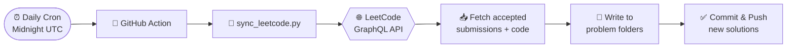

<div align="center">

# 🧩 LeetCode Solutions

### My auto-synced journey through LeetCode, one problem at a time.

<br>

[](https://leetcode.com/u/jithin-jz/)
[](#-how-it-works)

<br>


</div>

---

## ✨ Overview

This repository automatically collects my accepted LeetCode submissions and organizes them into a clean, browsable structure. There's no manual copy-pasting — a scheduled GitHub Action fetches my latest solutions straight from LeetCode's API and commits them for me.

> Every solved problem gets its own folder containing the solution file and a README with the problem's difficulty, topics, and a direct link.

---

## 🚀 How It Works



1. **Scheduled trigger** — a GitHub Action runs every day at midnight UTC (also triggerable manually).
2. **Fetch** — a Python script queries LeetCode's GraphQL API for recently accepted submissions.
3. **Organize** — each solution is written to its own numbered folder with a generated README.
4. **Commit** — only new or changed solutions are committed, keeping the history clean.

---

## 📁 Repository Structure

```
LeetCode/
├── .github/workflows/
│   └── sync.yml                 # ⚙️  Daily sync workflow
├── scripts/
│   └── sync_leetcode.py         # 🐍 The sync engine
├── requirements.txt             # 📦 Python dependencies
│
├── 0001-two-sum/
│   ├── 0001-two-sum.py          # 💡 Solution
│   └── README.md                # 📄 Problem details
├── 0002-add-two-numbers/
│   └── ...
└── ...
```

---

## ⚙️ Setup

Want to fork this and sync your own solutions? Here's how.

<details>
<summary><b>1. Add your LeetCode credentials as repository secrets</b></summary>

<br>

Go to **Settings → Secrets and variables → Actions** and add:

| Secret Name           | Where to find it                                   |
| :-------------------- | :------------------------------------------------- |
| `LEETCODE_SESSION`    | Browser cookie `LEETCODE_SESSION` on leetcode.com  |
| `LEETCODE_CSRF_TOKEN` | Browser cookie `csrftoken` on leetcode.com         |

</details>

<details>
<summary><b>2. How to grab your cookies</b></summary>

<br>

1. Log in to [leetcode.com](https://leetcode.com)
2. Open DevTools (`F12`) → **Application** → **Cookies** → `https://leetcode.com`
3. Copy `LEETCODE_SESSION` and `csrftoken`
4. Paste them into the matching repository secrets

</details>

<details>
<summary><b>3. Run it</b></summary>

<br>

Head to the **Actions** tab → **Sync LeetCode Solutions** → **Run workflow**.
After the first run, it syncs automatically every day. 🎉

</details>

> ⚠️ **Heads up:** LeetCode session cookies expire every couple of weeks. When sync stops working, just refresh the `LEETCODE_SESSION` secret with a fresh cookie value.

---

<div align="center">

### 💻 Solving problems, one commit at a time.

**[Visit my LeetCode Profile →](https://leetcode.com/u/jithin-jz/)**

</div>
